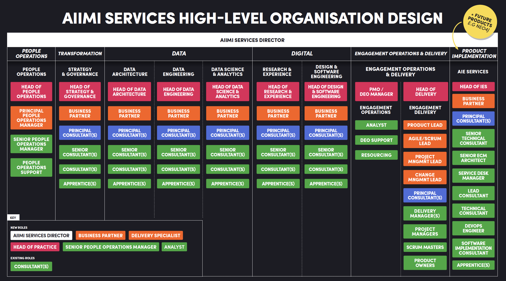

# **Aiimi's structure**

## Head of Data & AI Engineering

### Josh Swords

* Technologies you're familiar with  
  * Azure stack
  * PyTorch, sklearn
  * Huggingface

* What's your favorite technology to use and why
  * FastAPI -- I love building things!

* Fun fact / non technical skill you want to talk about  
  * I love to travel to off-beaten-path destinations
 
  
## Business Partner(s)

## Principal Data Consultant(s)
### Ian Skelton

* Technologies you're familiar with  
  * Databricks
  * Delta Lake
  * Azure Data Stack
  * SQL Server BI Stack
  * PowerBI
  * MongoDb
  * Terraform
  * GIT

* What's your favorite technology to use and why
  * Right now, it has to be Databricks. It's come a long way in a relatively short space of time and handles pretty much all aspects of a Data Engineering pipeline. 

* Any DE/AI relevant courses/qualifications
  * dbt Fundamentals
  * AZ-104/AZ-305 - Azure Solutions Architect Expert
  * AZ-104 - Azure Administrator Associate
  * DP-203 - Azure Data Engineer Associate
  * PL-300 - Power BI Data Analyst Associate
  * PL-900 - Power Platform Fundamentals
  * DP-900 - Azure Data Fundamentals
  * AZ-900 - Azure Fundamentals

* Fun fact / non technical skill you want to talk about  
  * My mastermind specialist subject would be The Simpsons, season 1-10!

## Senior Data Consultant(s)

### Suzanne Wallace

* Technologies you're familiar with  
  * ADF/Databricks
  * Azure Stack, Cosmos db
  * Google Cloud Platform
  * Amazon Web Services
  * Open AI
  * Terraform & IaC
  * Devops/CICD/git
    
* What's your favorite technology to use and why  
    Databricks - because you can process, transform and do analytics on data in one place. 

* Any DE/AI relevant courses/qualifications  
  * DP-203 - Azure Data Engineer Associate
  * AI-102 - Azure AI Engineer Associate
  * AI-900 - Azure AI Fundamentals

* Fun fact / non technical skill you want to talk about  
  * I'm going to start to learn Taekwondo!

## Data Consultant(s)

### Jake Pullen

* Technologies you're familiar with  
  * ADF
  * Databricks
  * Azure Stack
  * PowerBi
  * Linux
  * GIT

* What's your favorite technology to use and why  
    Databricks, as it is a very powerful tool that can be used for a wide range of tasks and handles big data very well.

* Any DE/AI relevant courses/qualifications  
  * DP-203 - Azure Data Engineer Associate(In Progress)
  * PL-300 - Power BI Data Analyst Associate (Lapsed)

* Fun fact / non technical skill you want to talk about  
  * A covid success story. Before the pandemic I worked in retail. I was furloughed and used the time to learn.

### Jon Bohnel

* Technologies you're familiar with 
  * Databricks
  * Azure
  * GIT
  * Grafana

* What's your favorite technology to use and why 
  * Data wise - Databricks, it can already do lots of different jobs but more keeps being added all the time
  * Outside of data - Selenium WedDriver, it is always pretty cool to watch the output of your code as the driver clicks around a webpage

* Any DE/AI relevant courses/qualifications  
  * DP-203 - Azure Data Engineer Associate (In Progress)

* Fun fact / non technical skill you want to talk about  
  * I run a 6-a-side football team in London

## Data Apprentices(s)
