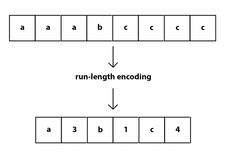
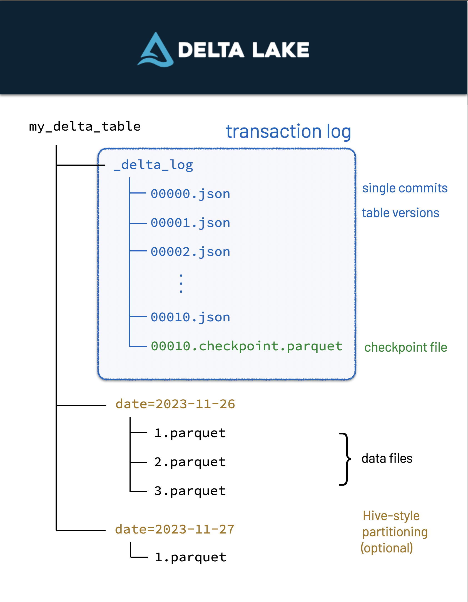

# **Concepts**

## **The importance of file formats**

File formats are an often overlooked yet crucial part of data engineering. They determine how data is stored, compressed, and accessed. Choosing the right file format can impact data processing speed, storage efficiency, and interoperability with other systems. Common file formats include:

* CSV:

CSV are probably the dataset you'll have handled the most, and it is fine for small datasets. However, it is incredibly inefficient. To filter csv data, we first have to read the entire dataset, and *then* reduce it to what we need.

* Parquet:

An incredibly scalable data format, Parquet powers the modern data type boom (Delta, Iceberg), and so it is important to understand it. Parquet benefits from run-length-encoding - the idea is to replace consecutive occurrences of a given symbol with only one copy of the symbol, plus a count of how many times that symbol occurs—hence, the name run length. This enables massive compression of data when ordered correctly.

In addition, parquet is column-oriented. This means that we can read in only the columns of data we are interested in, rather than reading in all the data and *then* selecting what we need.

* Delta:

Delta files are built-on parquet files - which means it has all of parquet's benefits plus more.
Delta Lake uses versioned Parquet files to store your data in your cloud storage. Apart from the versions, Delta Lake also stores a transaction log to keep track of all the commits made to the table or blob store directory to provide ACID transactions.

## **Partitioning**

Partitioning is the process of dividing a dataset into smaller, more manageable parts. This can improve query performance by reducing the amount of data that needs to be scanned. Common partitioning strategies include:

* Range partitioning: Dividing data into ranges based on a specific column, such as date or ID.

* Hash partitioning: Dividing data into buckets based on a hash function applied to a specific column.

* List partitioning: Dividing data into lists based on specific values in a column.

Partitioning can be done on disk or in memory, and can be static or dynamic. It is important to choose the right partitioning strategy based on the characteristics of your data and the queries you need to run.

## **ETL/ELT**

Pros and cons of ETL vs ELT:  

* ETL is better for traditional data warehousing, where data is cleaned and transformed before being loaded into the warehouse. This makes it easier to analyse the data, but can be slower and more resource-intensive.  

* ELT is better for big data and cloud-based data warehousing, where data is loaded into the warehouse first and then transformed. This can be faster and more scalable, but can also be more complex and harder to manage.  

* ETL is better for structured data, where the schema is known in advance.

* ELT is better for unstructured or semi-structured data, where the schema may change over time.

Typically in our data engineering role we should know when is best to use either ETL or ELT, and be able to implement both.

## **OLAP & OLTP**

OLAP (Online Analytical Processing) systems are designed to handle complex queries and large volumes of data, and are primarily used for business intelligence and data analysis. OLAP systems are optimised for read-heavy workloads, and are typically used to generate reports, dashboards, and other analytical outputs.

OLTP (Online Transaction Processing) systems are designed to handle high volumes of transactions, and are primarily used for transactional workloads such as e-commerce, banking, and other real-time applications. OLTP systems are optimised for write-heavy workloads, and are typically used to process transactions, update records, and perform other real-time operations.

Typically in our data engineering role we pull data from OLTP systems, transform it, and load it into OLAP systems for analysis. However we should also consider the use of OLAP systems for real-time analytics, and OLTP systems for batch processing, being able to implement both.

## **ACID Transactions**

ACID (Atomicity, Consistency, Isolation, Durability) transactions are a set of properties that guarantee the reliability and consistency of database transactions. ACID transactions ensure that database operations are completed successfully and that data is not lost or corrupted.

* Atomicity: All operations in a transaction are completed successfully, or none of them are completed at all.

* Consistency: The database remains in a consistent state before and after a transaction.

* Isolation: Transactions are isolated from each other, so that the results of one transaction do not affect the results of another.

* Durability: Once a transaction is committed, its results are permanent and cannot be undone.

ACID transactions are essential for maintaining data integrity and reliability in database systems, and are a key consideration in data engineering.

## **Distributed Compute**

Distributed computing is a computing paradigm in which multiple computers work together to solve a problem or perform a task. Distributed computing can improve performance, scalability, and fault tolerance by distributing workloads across multiple machines.

This way of working is essential for big data processing, as it allows us to process large volumes of data quickly and efficiently, something that would be impossible with a single machine.
