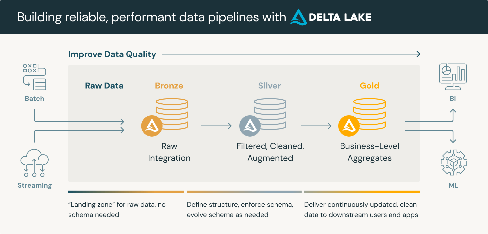

# **Common Architectural Patterns**

Architectural design choices must be made based on the use case at hand. However, some designs appear more than others.

## **Lake-based Architectures**

Lake-based architectures leverage data lakes to store large volumes of raw and processed data in a flexible and scalable manner. These architectures are commonly used for big data analytics and machine learning use cases.

In the Azure stack, this means heavily utilising **blob storage** (also referred to as Azure Data Lake Storage)

### **Medallion Architecture**

The Medallion Architecture, also known as the "bronze, silver, gold" , or "Multi-Hop" architecture, organises data in a layered approach within a data lake. Data is ingested into the "bronze" layer, refined in the "silver" layer, and enriched for business use in the "gold" layer.

It's important to note that the layers are *guidelines*. In practice, we may have many more layers for differing purposes. For example, we may have an initial "Landing" layer for inbound data. There might be several phases within a "Silver" layer for different use cases.

Also worth noting is that the naming convention of "bronze, silver, gold" is fluid. For example it may be referred to as "raw, base, curated".

The **core principle** is that we begin with raw unprocessed data which provides a *single source of the truth*, and then we progressively increase quality until the "gold" or "curated" report-ready data.

**Pros:**

Data Quality: Enhances data quality through incremental processing stages.
Scalability: Scalable storage and processing using data lake capabilities.
Flexibility: Adapts to various data sources and types, supporting diverse analytical needs.

**Cons:**

Complexity: Complexity & storage costs.

### **Write-Audit-Publish**

Write-Audit-Publish (WAP) is a data processing pattern that ensures data integrity and auditability.

Data is first written to a raw layer, then audited for quality and compliance, and finally published for consumption. It is similar to the Medallion Architecture but subtly different.

**Pros:**

Data Integrity: Ensures data is validated and compliant before consumption.
Auditability: Provides a clear audit trail of data processing and changes.
Quality Assurance: Enhances data quality through systematic auditing.

**Cons:**

Implementation Effort: Requires careful implementation of auditing and publishing mechanisms.

### **Data Lakehouse**

The above architectures lend themselves to a Data Lakehouse architecture, which we commonly employ.

A data lakehouse is a modern data architecture that creates a single platform by combining the key benefits of data lakes (large repositories of raw data in its original form) and data warehouses (organized sets of structured data). Specifically, data lakehouses enable organizations to use low-cost storage to store large amounts of raw data while providing structure and data management functions. 

**Data lakehouse vs. data lake vs. data warehouse**
The term “data lakehouse” merges two types of existing data repositories: the data warehouse and the data lake. So, what exactly are the differences when it comes to a data lakehouse vs. data lake vs. data warehouse? 

**Data warehouses**
Data warehouses provide fast access to data and SQL compatibility for business users that need to generate reports and insights for decision-making. All data must go through ETL (extract, transform, load) phase. This means it is optimized in a specific format, or schema, based on the use case before it is loaded to support high-performance queries and data integrity. However, this approach limits the flexibility of access to the data and creates additional costs if data needs to be moved around for future use. 

**Data lakes**
Data lakes store large amounts of unstructured and structured data in its native format. Unlike data warehouses, data is processed, cleaned up, and transformed during analysis to enable faster loading speeds, making them ideal for big data processing, machine learning, or predictive analytics. However, they require expertise in data engineering, which limits the set of people who can use the data, and if they’re not properly maintained, data quality can deteriorate over time. Data lakes also make it more challenging to get real-time queries as the data is unprocessed, so it still potentially needs to be cleaned, processed, ingested, and integrated before it can be used. 

**Data lakehouse**
A data lakehouse merges these two approaches to create a single structure that allows you to access and leverage data for many different purposes, from BI to data science to machine learning. In other words, a data lakehouse captures all of your organization’s unstructured, structured, and semi-structured data and stores it on low-cost storage while providing the capabilities for all users to organize and explore data according to their needs.

## **Other Notable Architectures**

Lambda, Kappa, etc. To do.
