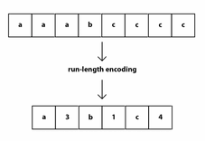
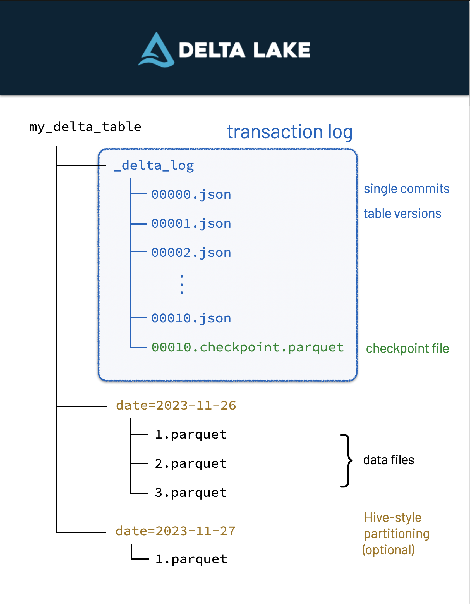

# **Concepts**

**The importance of file formats**

File formats are an often overlooked yet crucial part of data engineering. They determine how data is stored, compressed, and accessed. Choosing the right file format can impact data processing speed, storage efficiency, and interoperability with other systems. Common file formats include:

* CSV:

CSV are probably the dataset you'll have handled the most, and it is fine for small datasets. However, it is incredibly inefficient. To filter csv data, we first have to read the entire dataset, and *then* reduce it to what we need.

* Parquet:

An incredibly scalable data format, Parquet powers the modern data type boom (Delta, Iceberg), and so it is important to understand it. Parquet benefits from run-length-encoding - the idea is to replace consecutive occurrences of a given symbol with only one copy of the symbol, plus a count of how many times that symbol occurs—hence, the name run length. This enables massive compression of data when ordered correctly.

In addition, parquet is column-oriented. This means that we can read in only the columns of data we are interested in, rather than reading in all the data and *then* selecting what we need.

* Delta:

Delta files are built-on parquet files - which means it has all of parquet's benefits plus more.
Delta Lake uses versioned Parquet files to store your data in your cloud storage. Apart from the versions, Delta Lake also stores a transaction log to keep track of all the commits made to the table or blob store directory to provide ACID transactions.

**Partitioning**

**ETL/ELT**

**OLAP & OLTP**

**ACID Transactions**

**Distributed Compute**

....
