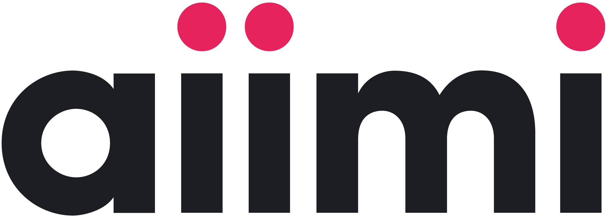

# **Data &amp; AI Engineering onboarding pack**

[In Progress 05/07/2024]

### Welcome to aiimi!

This is your onboarding pack. It is *not* intended to teach you to become a data engineer. Rather, it aims to quickly acclimate you to the aiimi landscape and help you to understand our commonly used approaches and technologies.

In addition, all aiimi employees are enrolled to the Aiimi Leadership Training Program (ALTP), which will help develop you further as a consultant at aiimi.

Note that '00 Resources' contains *at a glance* documents which should help you during client engagements. Use these when you need quick inspiration.

The rest of the curricula is in its suggested order.

-------------

Onboarding curriculum:

* **00 Resources**
    * Checklists
    * Use Cases and Suggested Solutions

* **01 Orientation**: 
    * Company values
    * Structure
    * Heads of practice
    * Mentorship
    * Community of Practice for Data (CoP-Data)

- **02 Consulting basics**: 
    * Customer focus
    * Professionalism
    * Presentation skills
    * Scrum & Agile working
    * What makes aiimi different

* **03 Roles & responsibilities of a consultant data engineer**: 
    * Understanding client needs
    * Technical expertise
    * Staying up to date with industry developments
    * Leadership
    * Role model

* **04 Our commonly used tech stack and recommended learning pathways**:
    * Languages: PySpark, SQL, 
    * Azure eco-system, Databricks, etc. 
    * Microsoft learn, suggested certifications etc.
    * Version control

* **05 Our commonly used architectural patterns**: 
    * Data lake and Data Lakehouse Medallion architecture
    * Data modeling techniques (Inmon, Kimball, OBT, etc)
    * Data warehousing concepts (ETL, OLAP vs. OLTP), etc
  
* **06 Case studies**: 
    * Successful projects
    * Lessons learned, mistakes we’ve made
    * Examples of how different practices operate together e.g. data engineering, software, data science etc.
  
* **07 Technical playbooks**: 
    * Code examples
  
* **08 Advanced techniques**: 
    * Spark optimisation
    * AI Engineering
    * Software engineering best practices
    * CI/CD
    * Docker

* **09 aiimi style guide**:
    * PySpark
    * SQL
